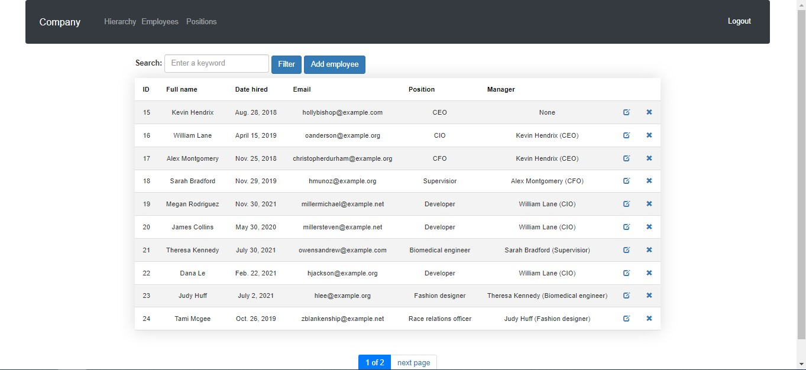

# Company chart Manager

Django project for managing company chart

## Installation

```shell
git clone https://github.com/SafonovVladimir/employees.git
cd employees
python -m venv venv
venv\Scripts\activate (on Windows)
source venv/bin/activate (on macOS)
pip install -r requirements.txt
python manage.py runserver #Starts Django Server
```

## Features

* Authentication functionality for User
* Managing employees and positions
* Sort by every column in ascending and descending order
* Pagination of Employees page
* Checking username while Login and Sign Up
* Powerful admin panel for advanced managing

## Credential for testing
* login: admin
* password: admin

## Demo
* Login page


* Sign Up page


* Employees List


* Sort by Full name (desc)

